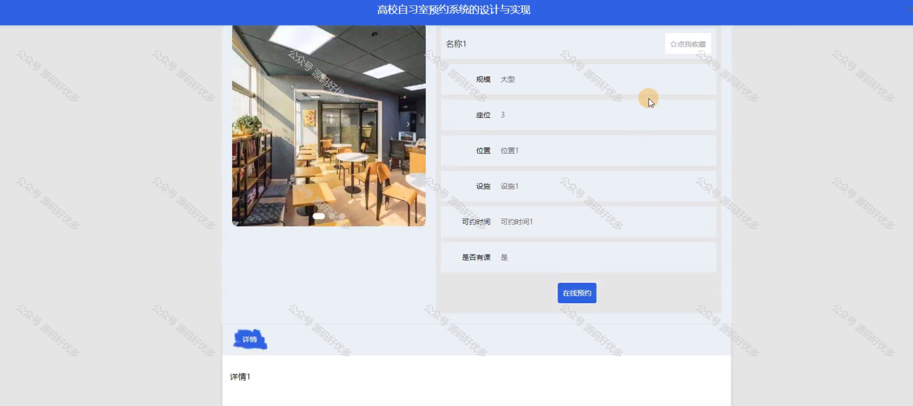
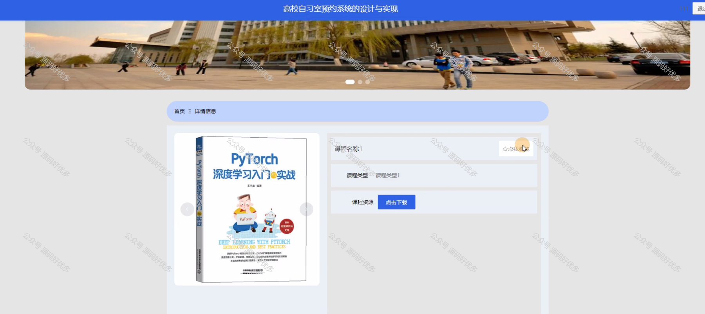
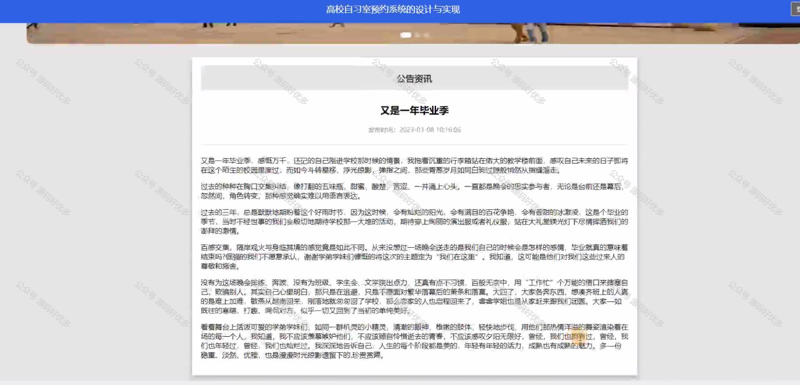
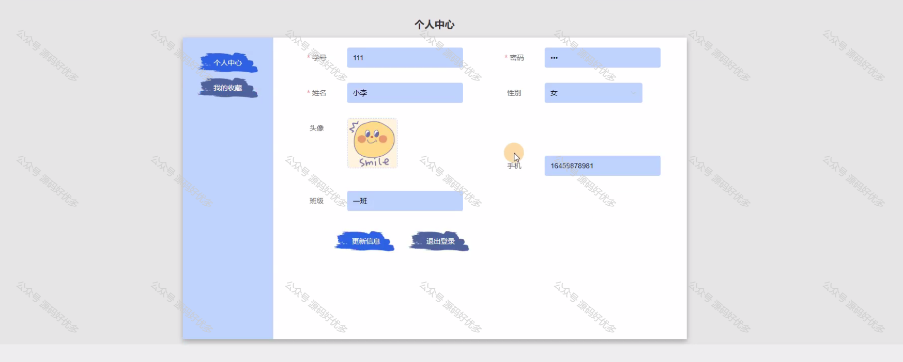
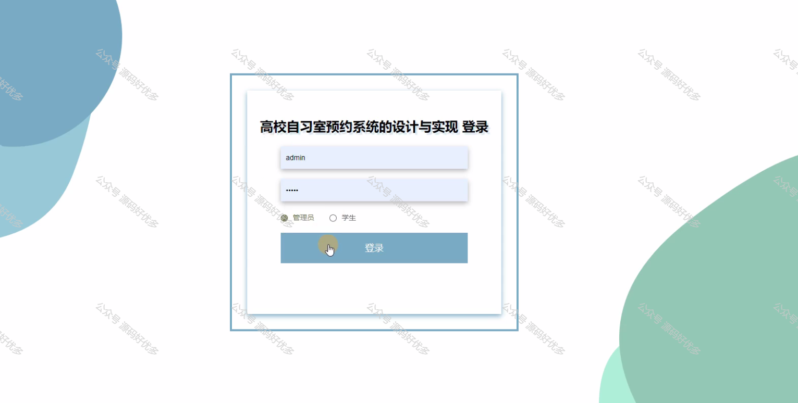
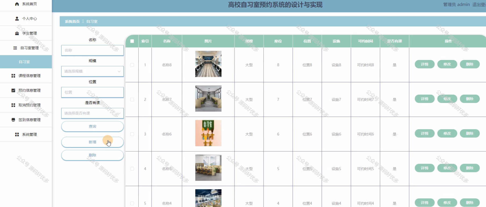
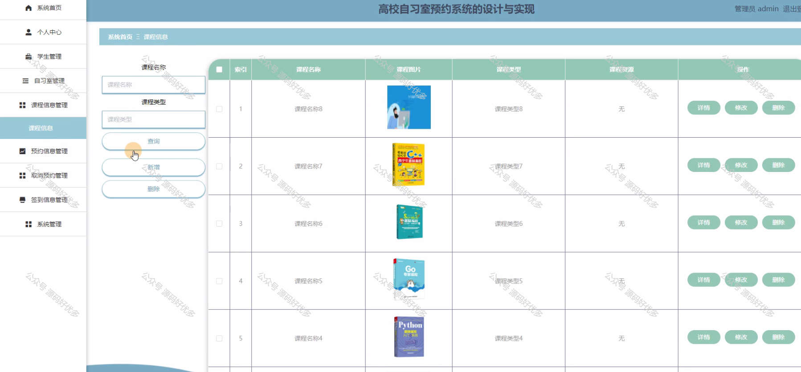
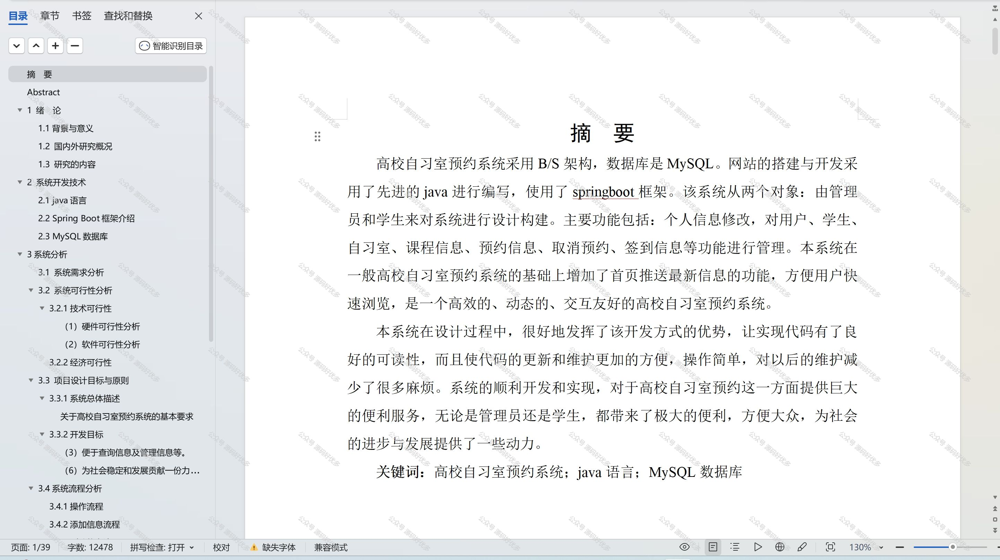

 
## 查看主页获取源码

### 一、作品包含

源码+数据库+设计文档万字+PPT+全套环境和工具资源+部署教程

### 二、项目技术

前端技术：Html、Css、Js、Vue、Element-ui

数据库：MySQL

后端技术：Java、Spring Boot、MyBatis

  

### 三、运行环境

开发工具：IDEA/eclipse

数据库：MySQL5.7

数据库管理工具：Navicat10以上版本

环境配置软件： JDK1.8+Maven3.6.3

前端Nodejs：14

### 四、项目介绍
项目编号：springbootA175

高校自习室预约系统是为了更好地满足学生对自习空间的需求，提高自习室的利用效率，优化校园资源配置而开发的。系统以高校为背景，紧密结合学生的实际需求，旨在为学校提供一个便捷、高效、智能的自习室预约和管理平台。通过该系统，学生可以方便地预约自习室，学校可以更好地管理自习室资源，提高自习室的利用效率，为学生提供一个良好的学习环境。同时，该系统还可以帮助学校了解学生的自习需求，为学校的自习室建设提供参考。

前台学生功能：首页、自习室、课程信息、公告资讯、后台管理和个人中心。

后台分为管理员和学生
管理员的功能：系统的首页、个人中心、学生管理、自习室管理、课程信息管理、预约信息管理、取消预约管理、签到信息管理以及系统管理。
学生的功能：系统首页、个人中心、预约信息管理、取消预约管理、签到信息管理。

### 五、运行截图

  
